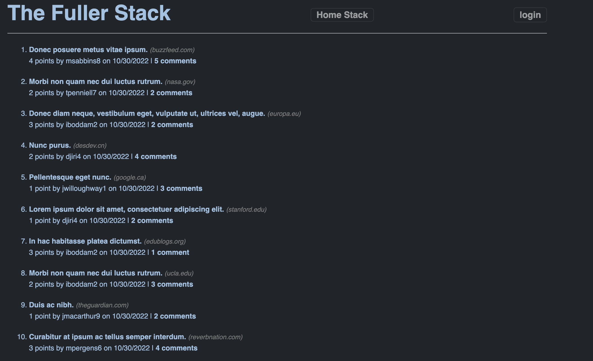

# TheFullerStack

## Purpose:
To create a full stack website that allows users to post, update, read, and vote different articles/posts.

## Built With: 
- JavaScript
- Expressjs
- MySQL
- Sequelize
- Handlebars
- NodeJS

## Links

Link to deployed app:
https://protected-harbor-61276.herokuapp.com/

Link to GitHub:
https://github.com/AlexDefrese/TheFullerStack

## Contribution:
Made by Alex Defrese
